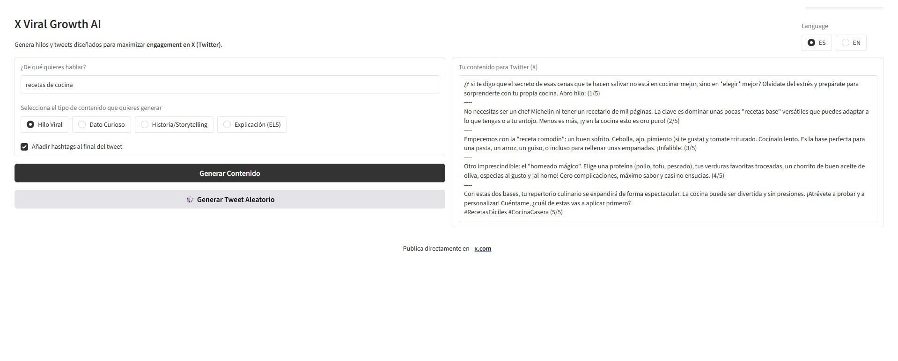

# X Viral Growth AI

Generador de tweets e hilos virales para **X (Twitter)** construido en Python utilizando **Gradio** y **Google Gemini API**.  
Este proyecto está pensado como pieza de portfolio y demuestra cómo combinar IA generativa, prompt engineering y una interfaz web ligera para crear contenido optimizado para engagement.

---

## Características

- Generación de **tweets e hilos virales** orientados a engagement
- Soporte multilenguaje: **Español (ES)** e **Inglés (EN)**
- Diferentes formatos de contenido:
  - Hilo Viral (5 tweets)
  - Dato Curioso
  - Historia / Storytelling
  - Explicación estilo ELI5
- Opción para **añadir o no hashtags**
- Generación de **temas aleatorios**
- Interfaz web simple y rápida con **Gradio**
- Prompts optimizados para:
  - Sonar humano
  - Evitar clichés
  - Cumplir el límite de 280 caracteres
  - Reducir detección como contenido generado por IA

---

## Tecnologías utilizadas

- **Python 3**
- **Gradio** (UI)
- **Google Gemini API** (`gemini-2.5-flash`)
- **dotenv** para gestión de variables de entorno

---

## Demo

La aplicación genera contenido listo para copiar y pegar directamente en **X (Twitter)**, incluyendo hilos correctamente separados y numerados cuando corresponde.

---

## Instalación

### 1. Clonar el repositorio

```bash
git clone https://github.com/tu-usuario/x-viral-growth-ai.git
cd x-viral-gro
```
## 2. Crear entorno virtual (opcional pero recomendado)

```bash
python -m venv venv
source venv/bin/activate  # Linux / macOS
venv\Scripts\activate     # Windows
```
## 3. Instalar dependencias

```
pip install -r requirements.txt
```
## Dependencias principales: 
* gradio
* google-generativeai
* python-dotenv
* Pillow

## Configuración de la API 
Este proyecto utiliza la **Google Gemini API**. 
**1.** Obtén tu API Key en Google AI Studio. 
**2.** Crea un archivo .env en la raíz del proyecto: 
```
    GEMINI_API_KEY=tu_api_key  
``` 
## Uso 
Ejecuta la aplicación con: 
```
python app.py
```
Gradio levantará un servidor local, normalmente en: http://127.0.0.1:7860 

## Estructura del proyecto 
´´´
. 
├── app.py 
├── .env 
├── requirements.txt 
├── favicon.png 
├── README.md 
```

### Autora 
Proyecto creado por **Irene Smykla Jiménez** para el aprendizaje en IA generativa, Python, prompt engineering

### Imagen del Proyecto

